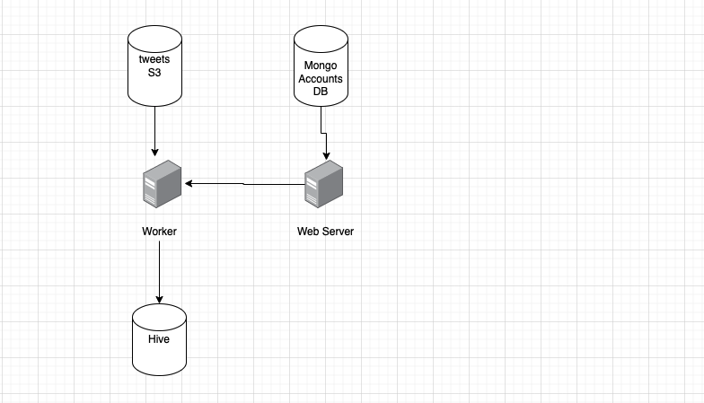

## About the project
AUI assignment, on top of Django

### Part 1:
Handled in `assignment/apis`

### Part 2:
Partially handled in `assignment/management/commands/enrich_tweets.py`
Can we run using

```
./manage.py enrich_tweets http://aui-lab-data-engineer-resources.s3.amazonaws.com/tweets/clubs-tweets.parquet
```

### Part 3:
I've drafted the following queries, was blocked in step 2 data insert

1. Query count per club
```
SELECT club, count(DISTINCT tweet_id) as total_tweets FROM tweets
WHERE club='Real Madrid' OR club = 'Barcelona'
GROUP BY club;
```

2. Total reactions per club, select top 3 clubs
```
SELECT club, tweet_favorite_count_sum + tweet_retweeted_sum as tweet_reaction FROM (
    SELECT club, sum(tweet_favorite_count) AS tweet_favorite_count_sum, sum(tweet_retweet_count) AS tweet_retweeted_sum
    FROM (
        SELECT DISTINCT tweet_id, club, tweet_favorite_count, tweet_retweet_count
        FROM tweets
        WHERE tweet_created_at BETWEEN '2019-1-1 00:00:00.000000' AND '2020-1-1 00:00:00.000000'
    ) as distinct_tweets
    GROUP BY club
) as temp
ORDER BY tweet_reaction desc
LIMIT 3;
```

3. Top two trending hashtags

```
SELECT MONTH(tweet_created_at) as tweet_month, hashtag, count(*) as hashtag_in_month
FROM tweets
WHERE tweet_created_at BETWEEN '2018-1-1 00:00:00.000000' AND '2020-1-1 00:00:00.000000'
group by hashtag, MONTH(tweet_created_at)
order by hashtag_in_month desc
LIMIT 2;
```
### Part 4:

1. Local version diagram



2. AWS version diagram


## Setup Steps

```
virtualenv venv

source venv/bin/activate

pip install -r requirements.txt

[Configure env. variables if not working local]


```
## Installing Hive on local docker
Follow this link
https://github.com/big-data-europe/docker-hive

create `tweets` table

```
CREATE TABLE `tweets` (
	`tweet_id` BIGINT, 
	`tweet_created_at` TIMESTAMP, 
	`tweet_favorite_count` BIGINT, 
	`tweet_favorited` BOOLEAN, 
	`tweet_lang` STRING, 
	`tweet_retweet_count` BIGINT, 
	`tweet_retweeted` BOOLEAN, 
	`user_id_str` BIGINT, 
	`user_name` STRING, 
	`user_location` STRING, 
	`club` STRING, 
	`hash_tag` STRING
) PARTITIONED BY(club string);
```
## Running the app

If you don't have `local.py` in your settings, copy `settings/local.template.py` to `settings/local.py`
and don't forget to update the keys if missing (like mailgun key)


Then run django server

```
python manage.py runserver
```

